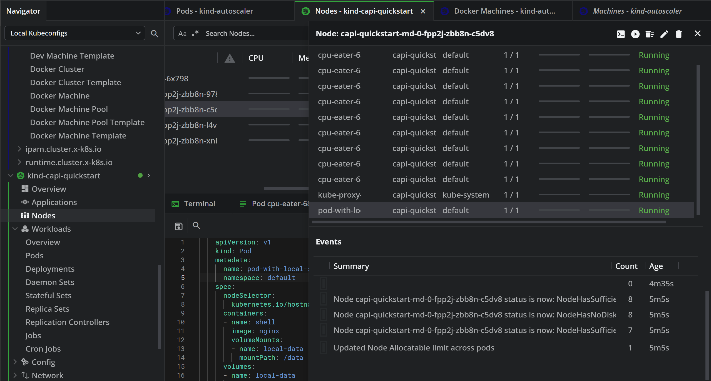
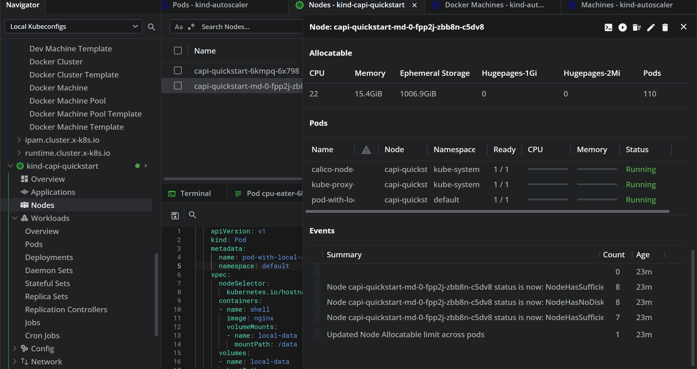

# Lab: Cluster Autoscaler
## I. Cài đặt môi trường
### **⭐ Phiên bản Tương thích được Sử dụng trong Lab**

Để đảm bảo mọi thứ hoạt động trơn tru, chúng ta sẽ thống nhất sử dụng các phiên bản sau:

  * **Kubernetes (cho cả management & workload cluster):** `v1.33.0`
  * **Cluster API (CAPI):** 
  ```sh
  $ clusterctl version
clusterctl version: &version.Info{Major:"1", Minor:"10", GitVersion:"v1.10.4", GitCommit:"737edc88faed28b0bd81f6768ebe2ea276fdbe3a", GitTreeState:"clean", BuildDate:"2025-07-15T16:15:17Z", GoVersion:"go1.23.10", Compiler:"gc", Platform:"linux/amd64"}
  ```
  * **Infrastructure Provider (Docker - CAPD)**
  * **Cluster Autoscaler (CA):** `v1.33.0` (tương thích với Kubernetes v1.33.x)

-----

### **Pha 0: Chuẩn bị Môi trường**

1.  **Docker:** Cần thiết để chạy các node Kubernetes dưới dạng container. Hãy cài đặt Docker Desktop hoặc Docker Engine.
2.  **kubectl:** Công cụ dòng lệnh để tương tác với cluster Kubernetes.
3.  **Kind (Kubernetes in Docker):** Dùng để tạo management cluster một cách nhanh chóng.
    ```bash
    # For AMD64 / x86_64
    [ $(uname -m) = x86_64 ] && curl -Lo ./kind https://kind.sigs.k8s.io/dl/v0.29.0/kind-linux-amd64
    # For ARM64
    [ $(uname -m) = aarch64 ] && curl -Lo ./kind https://kind.sigs.k8s.io/dl/v0.29.0/kind-linux-arm64
    chmod +x ./kind
    sudo mv ./kind /usr/local/bin/kind
    ```
4.  **clusterctl:** Công cụ dòng lệnh của Cluster API.
    ```sh
    curl -L https://github.com/kubernetes-sigs/cluster-api/releases/download/v1.10.4/clusterctl-linux-amd64 -o clusterctl

    sudo install -o root -g root -m 0755 clusterctl /usr/local/bin/clusterctl
    ```

-----

### **Pha 1: Khởi tạo Management Cluster (Cụm Quản lý)**

Cụm này sẽ không chạy workload của bạn, mà chỉ dùng để quản lý các cluster con khác.

1.  **Tạo Kind Cluster:**
  ```bash
  cat > kind-cluster-with-extramounts.yaml <<EOF
  kind: Cluster
  apiVersion: kind.x-k8s.io/v1alpha4
  networking:
    ipFamily: dual
  nodes:
  - role: control-plane
    extraMounts:
      - hostPath: /var/run/docker.sock
        containerPath: /var/run/docker.sock
  EOF

  kind create cluster --name autoscaler --config kind-cluster-with-extramounts.yaml
  ```

2.  **Xác nhận Cluster đã sẵn sàng:**
  ```bash
  kubectl cluster-info --context kind-capi-management
  ```
  Bạn sẽ thấy thông tin về control plane của cluster vừa tạo.

-----

### **Pha 2: Cài đặt Cluster API vào Management Cluster**

1.  **Thực hiện `clusterctl init`:**
    Lệnh này sẽ cài đặt các CRD (Custom Resource Definitions) và các controller cần thiết cho CAPI và provider Docker.
    ```bash
    # Enable the experimental Cluster topology feature.
    export CLUSTER_TOPOLOGY=true

    # Initialize the management cluster
    clusterctl init --infrastructure docker
    ```
- **Logs sẽ có dạng như sau:**
    ```bash
    Installing cert-manager version="v1.18.1"
    Waiting for cert-manager to be available...
    [KubeAPIWarningLogger] spec.privateKey.rotationPolicy: In cert-manager >= v1.18.0, the default value changed from `Never` to `Always`.
    Installing provider="cluster-api" version="v1.10.4" targetNamespace="capi-system"
    [KubeAPIWarningLogger] spec.privateKey.rotationPolicy: In cert-manager >= v1.18.0, the default value changed from `Never` to `Always`.
    Installing provider="bootstrap-kubeadm" version="v1.10.4" targetNamespace="capi-kubeadm-bootstrap-system"
    [KubeAPIWarningLogger] spec.privateKey.rotationPolicy: In cert-manager >= v1.18.0, the default value changed from `Never` to `Always`.
    Installing provider="control-plane-kubeadm" version="v1.10.4" targetNamespace="capi-kubeadm-control-plane-system"
    [KubeAPIWarningLogger] spec.privateKey.rotationPolicy: In cert-manager >= v1.18.0, the default value changed from `Never` to `Always`.
    Installing provider="infrastructure-docker" version="v1.10.4" targetNamespace="capd-system"
    [KubeAPIWarningLogger] spec.privateKey.rotationPolicy: In cert-manager >= v1.18.0, the default value changed from `Never` to `Always`.

    Your management cluster has been initialized successfully!

    You can now create your first workload cluster by running the following:

      clusterctl generate cluster [name] --kubernetes-version [version] | kubectl apply -f -
    ```
-----

### **Pha 3: Tạo Manifest Cluster (Cụm con)**

Đây là cluster mà ứng dụng sẽ chạy và cũng là nơi Cluster Autoscaler sẽ thực hiện co giãn.

1.  **Tạo tệp Manifest cho Workload Cluster:**
  Sử dụng `clusterctl generate` để tạo một tệp manifest mẫu.

    ```bash
    clusterctl generate cluster capi-quickstart --flavor development \
    --kubernetes-version v1.33.0 \
    > capi-quickstart.yaml

    ```
2. **Apply manifest vào cụm**
  ```bash
  kubectl apply -f capi-quickstart.yaml
  ```
  - Logs sẽ có dạng như sau:
  ```bash
  dockerclustertemplate.infrastructure.cluster.x-k8s.io/quick-start-cluster created
  kubeadmcontrolplanetemplate.controlplane.cluster.x-k8s.io/quick-start-control-plane unchanged
  dockermachinetemplate.infrastructure.cluster.x-k8s.io/quick-start-control-plane created
  dockermachinetemplate.infrastructure.cluster.x-k8s.io/quick-start-default-worker-machinetemplate created
  dockermachinepooltemplate.infrastructure.cluster.x-k8s.io/quick-start-default-worker-machinepooltemplate unchanged
  kubeadmconfigtemplate.bootstrap.cluster.x-k8s.io/quick-start-default-worker-bootstraptemplate unchanged
  cluster.cluster.x-k8s.io/capi-quickstart configured
  ```

3. **Kiểm tra cluster được tạo trong CRDs**
  ```bash
  kubectl get cluster
  ```
  - Kiểm tra các resource được tạo cùng cluster
  ```bash
  $ clusterctl describe cluster capi-quickstart
  NAME                                                           READY  SEVERITY  REASON                  
         SINCE  MESSAGE
Cluster/capi-quickstart                                        False  Warning   ScalingUp               
         19s    Scaling up control plane to 1 replicas (actual 0)
├─ClusterInfrastructure - DockerCluster/capi-quickstart-68qlr  True                                     
         19s
├─ControlPlane - KubeadmControlPlane/capi-quickstart-xztkh     False  Warning   ScalingUp               
         19s    Scaling up control plane to 1 replicas (actual 0)
│ └─Machine/capi-quickstart-xztkh-brdkf                        False  Info      Bootstrapping           
         16s    1 of 2 completed
└─Workers                                                                                        

  └─MachineDeployment/capi-quickstart-md-0-m6ncw               False  Warning   WaitingForAvailableMachines      19s    Minimum availability requires 1 replicas, current 0 available
    └─Machine/capi-quickstart-md-0-m6ncw-2lbm7-hlxb9           False  Info      WaitingForControlPlaneAvailable  3s     0 of 2 completed
  ```
  - Export kubeconfig
  ```bash
  kind get kubeconfig --name capi-quickstart > capi-quickstart.kubeconfig
  ```
  Khi này, các Machine sẽ ở trạng thái `Running` nhưng MachineSet và MachineDeployment vẫn sẽ không `Ready` cho đến khi cài CNI.

4. **Cài CNI Calico**
  ```bash
  kubectl --kubeconfig=./capi-quickstart.kubeconfig \
  apply -f https://raw.githubusercontent.com/projectcalico/calico/v3.26.1/manifests/calico.yaml
  ```
  - Check các pod ready
  ```
  kubectl --kubeconfig=./capi-quickstart.kubeconfig get pod -n kube-system
  ```


## **Thiết Kế Các Bài Lab Thực Tế**

Để chứng minh các đề xuất trên, chúng ta sẽ thiết kế 3 bài lab với độ khó tăng dần.

### **Lab 1: Chứng minh Cấu hình Min/Max Size và Scale-Up/Down Cơ Bản**
- Thực hiện cài `Cluster Autoscaler` vào cụm bằng helm
```sh
helm install cluster-autoscaler autoscaler/cluster-autoscaler \
  --namespace default \
  --set cloudProvider=clusterapi \
  --set autoDiscovery.clusterName=capi-quickstart \
  --set extraArgs.expander=least-waste \
  --set rbac.create=true \
  --set extraArgs.kubeconfig=/etc/workload/value \
  --set extraVolumeMounts[0].name=kubeconfig \
  --set extraVolumeMounts[0].mountPath=/etc/workload \
  --set extraVolumes[0].name=kubeconfig \
  --set extraVolumes[0].secret.secretName=capi-quickstart-kubeconfig \
  --set node-group-auto-discovery=clusterapi:clusterName=capi-quickstart \
  --set kubeconfig=/etc/workload/value \
  --set extraArgs.clusterapi-cloud-config-authoritative=true \
  --set extraArgs.expander=least-waste \
  --set extraArgs.scale-down-enabled=true \
  --set extraArgs.scale-down-delay-after-add=10m \
  --set extraArgs.scale-down-unneeded-time=10m \
  --set extraArgs.scale-down-utilization-threshold=0.6 \
  --set extraArgs.scale-down-unready-time=10m
```
- Các tham số thử nghiệm
  - `expander=least-waste`
  - `scale-down-enable`
  - `scale-down-unneede-time=10m`
  - `scale-down-utilization-threshold=0.6`
  - `scale-down-unready-time=10m`
**Mục tiêu:** Chứng minh CA tôn trọng annotation `min-size`, `max-size` và phản ứng với tải bằng cách scale-up và scale-down với các chiến lược expander, scale-down time và ngưỡng scale-down

**Các bước thực hiện:**

1.  **Chuẩn bị `MachineDeployment`:**
    Sửa `MachineDeployment` mà chúng ta đã cài trước đó và thêm các annotations sau:

    ```yaml
    apiVersion: cluster.x-k8s.io/v1beta1
    kind: MachineDeployment
    metadata:
      name: md-worker-pool-1
      annotations:
        "cluster.x-k8s.io/cluster-api-autoscaler-node-group-min-size": "1"
        "cluster.x-k8s.io/cluster-api-autoscaler-node-group-max-size": "4"
    spec:
      replicas: 1
      # ... phần còn lại của spec
    ```

2.  **Tạo Tải để Scale-Up:**
    Tạo một file `deployment-test.yaml` để tạo các pod yêu cầu tài nguyên, buộc CA phải hành động.

    ```yaml
    apiVersion: apps/v1
    kind: Deployment
    metadata:
      name: cpu-eater
    spec:
      replicas: 500 # Số replicas lớn để chắc chắn cần nhiều hơn 1 node
      selector:
        matchLabels:
          app: cpu-eater
      template:
        metadata:
          labels:
            app: cpu-eater
        spec:
          containers:
          - name: cpu-eater
            image: nginx
            resources:
              requests:
                cpu: "500m" # Yêu cầu 0.5 core CPU
    ```

    Áp dụng file này lên workload cluster.

3.  **Quan sát Scale-Up:**

      * Kiểm tra các pod: `kubectl get pods -o wide`. Chúng ta sẽ thấy nhiều pod ở trạng thái `Pending`.
      
      * Kiểm tra log của pod Cluster Autoscaler: `kubectl logs -f <cluster-autoscaler-pod-name> -n kube-system`. Chúng ta sẽ thấy các dòng log chỉ ra có các pod không thể được lập lịch và quyết định scale up.
      * Quan sát `MachineDeployment` trên management cluster. Chúng ta sẽ thấy trường `replicas` tăng dần từ 1 lên 4.
      
      * Kết quả: Cluster đã scale up lên số node cần thiết (nhưng không vượt quá 4).

4.  **Dọn dẹp Tải để Scale-Down:**
    Xóa deployment vừa tạo: `kubectl delete deployment cpu-eater`.

5.  **Quan sát Scale-Down:**

      * Chờ khoảng thời gian bằng giá trị của `--scale-down-unneeded-time` (ví dụ: 10 phút).
      * Quan sát log của CA, bạn sẽ thấy nó xác định các node là "unneeded".
      ```sh
      I0810 15:09:46.778979       1 cluster.go:173] Node capi-quickstart-md-0-fpp2j-zbb8n-nx4gb may be removed
      I0810 15:09:46.779104       1 clusterapi_controller.go:790] node "capi-quickstart-md-0-fpp2j-zbb8n-nx4gb" is in nodegroup "MachineDeployment/default/capi-quickstart-md-0-fpp2j"
      I0810 15:09:46.779118       1 cluster.go:155] Simulating node capi-quickstart-md-0-fpp2j-zbb8n-xnht9 removal
      I0810 15:09:46.779126       1 cluster.go:173] Node capi-quickstart-md-0-fpp2j-zbb8n-xnht9 may be removed
      I0810 15:09:46.779214       1 clusterapi_controller.go:790] node "capi-quickstart-md-0-fpp2j-zbb8n-xnht9" is in nodegroup "MachineDeployment/default/capi-quickstart-md-0-fpp2j"
      I0810 15:09:46.779231       1 cluster.go:155] Simulating node capi-quickstart-md-0-fpp2j-zbb8n-d5g58 removal
      I0810 15:09:46.779240       1 cluster.go:173] Node capi-quickstart-md-0-fpp2j-zbb8n-d5g58 may be removed
      I0810 15:09:46.779339       1 clusterapi_controller.go:790] node "capi-quickstart-md-0-fpp2j-zbb8n-d5g58" is in nodegroup "MachineDeployment/default/capi-quickstart-md-0-fpp2j"
      I0810 15:09:46.779355       1 cluster.go:155] Simulating node capi-quickstart-md-0-fpp2j-zbb8n-q7qnh removal
      I0810 15:09:46.779363       1 cluster.go:173] Node capi-quickstart-md-0-fpp2j-zbb8n-q7qnh may be removed
      I0810 15:09:46.779451       1 clusterapi_controller.go:790] node "capi-quickstart-md-0-fpp2j-zbb8n-q7qnh" is in nodegroup "MachineDeployment/default/capi-quickstart-md-0-fpp2j"
      I0810 15:09:46.779469       1 nodes.go:85] capi-quickstart-md-0-fpp2j-zbb8n-xnht9 is unneeded since 2025-08-10 15:02:24.172253912 +0000 UTC m=+2831.395475838 duration 6m46.135130183s
      I0810 15:09:46.779477       1 nodes.go:85] capi-quickstart-md-0-fpp2j-zbb8n-d5g58 is unneeded since 2025-08-10 15:02:24.172253912 +0000 UTC m=+2831.395475838 duration 6m46.135130183s
      I0810 15:09:46.779479       1 nodes.go:85] capi-quickstart-md-0-fpp2j-zbb8n-q7qnh is unneeded since 2025-08-10 15:02:24.172253912 +0000 UTC m=+2831.395475838 duration 6m46.135130183s
      I0810 15:09:46.779480       1 nodes.go:85] capi-quickstart-md-0-fpp2j-zbb8n-nx4gb is unneeded since 2025-08-10 15:02:24.172253912 +0000 UTC m=+2831.395475838 duration 6m46.135130183s
      I0810 15:09:46.779555       1 clusterapi_controller.go:790] node "capi-quickstart-md-0-fpp2j-zbb8n-d5g58" is in nodegroup "MachineDeployment/default/capi-quickstart-md-0-fpp2j"
      I0810 15:09:46.779646       1 clusterapi_controller.go:790] node "capi-quickstart-md-0-fpp2j-zbb8n-q7qnh" is in nodegroup "MachineDeployment/default/capi-quickstart-md-0-fpp2j"
      I0810 15:09:46.779754       1 clusterapi_controller.go:790] node "capi-quickstart-md-0-fpp2j-zbb8n-nx4gb" is in nodegroup "MachineDeployment/default/capi-quickstart-md-0-fpp2j"
      I0810 15:09:46.779840       1 clusterapi_controller.go:790] node "capi-quickstart-md-0-fpp2j-zbb8n-xnht9" is in nodegroup "MachineDeployment/default/capi-quickstart-md-0-fpp2j"
      I0810 15:09:46.779874       1 static_autoscaler.go:611] Scale down status: lastScaleUpTime=2025-08-10 14:49:37.801743678 +0000 UTC m=+2130.548217117 lastScaleDownDeleteTime=2025-08-10 13:10:53.982742803 +0000 UTC m=-3599.847060857 lastScaleDownFailTime=2025-08-10 13:10:53.982742803 +0000 UTC m=-3599.847060857 scaleDownForbidden=false scaleDownInCooldown=false
      I0810 15:09:46.779896       1 static_autoscaler.go:638] Starting scale down
      ```
      * Kiểm tra lại `MachineDeployment`: `kubectl get machinedeployment md-worker-pool-1`. Chúng ta sẽ thấy trường `replicas` giảm về `1` (giá trị `min-size`).
      
      * **Kết luận Lab 1:** CA hoạt động đúng với các giới hạn `min/max` và tự động scale theo tải.

### **Lab 2: Chứng minh Tham Số Bảo Vệ Scale-Down (`--skip-nodes-with-local-storage`)**

**Mục tiêu:** Chứng minh CA sẽ không xóa một node nếu trên đó có pod sử dụng local storage.

**Các bước thực hiện:**

1.  **Tạo môi trường:** Thực hiện lại các bước 1, 2, 3 của Lab 1 để scale cluster lên 2 hoặc 3 node.

2.  **Tạo pod với Local Storage:**
    Khi đã có nhiều node, hãy tạo một pod sử dụng `hostPath` và ghim nó vào một trong các node mới được tạo (không phải node đầu tiên).

    ```yaml
    apiVersion: v1
    kind: Pod
    metadata:
      name: pod-with-local-storage
    spec:
      nodeSelector:
        kubernetes.io/hostname: capi-quickstart-md-0-fpp2j-zbb8n-c5dv8
      containers:
      - name: shell
        image: nginx
        volumeMounts:
        - name: local-data
          mountPath: /data
      volumes:
      - name: local-data
        hostPath:
          path: /tmp/my-data
    ```

    Áp dụng file này vào cụm workload
    
    Thực hiện giảm tải cho các node để quan sát node `capi-quickstart-md-0-fpp2j-zbb8n-c5dv8` có bị xóa hay không.
    

3.  **Giảm tải chính:**
    Scale deployment `cpu-eater` về 0: `kubectl scale deployment cpu-eater --replicas=0`.
    Lúc này, các node được tạo thêm không còn cần thiết cho `cpu-eater` nữa. Tuy nhiên, một trong số chúng đang chạy `pod-with-local-storage`.

4.  **Quan sát:**

      * Chờ qua thời gian `--scale-down-unneeded-time`.
      * Kiểm tra log của CA. Bạn sẽ thấy log báo rằng nó đã bỏ qua việc scale down một node vì có pod với local storage: `skip-nodes-with-local-storage is enabled and node has pods with local storage`.
      * Kiểm tra `MachineDeployment`: `kubectl get machinedeployment capi-quickstart-md-0-fpp2j-zbb8n-c5dv8`. Bạn sẽ thấy số lượng `replicas` giảm, nhưng sẽ còn lại 2 node: node ban đầu và node đang chạy `pod-with-local-storage`. Các node "thừa" khác sẽ bị xóa.
      * **Kết luận Lab 2:** Tham số `--skip-nodes-with-local-storage=true` đã bảo vệ thành công node chứa dữ liệu stateful.

### **Lab 3: Chứng minh Chiến Lược Expander (`priority`)**

**Mục tiêu:** Chứng minh CA sẽ ưu tiên scale-up node group có `priority` cao hơn (giá trị số nhỏ hơn).

**Các bước thực hiện:**

1.  **Chuẩn bị 2 `MachineDeployment`:**

      * `md-general-purpose`: Dùng loại máy thường, rẻ tiền.
      * `md-gpu-intensive`: Dùng loại máy có GPU, đắt tiền.
      * Thêm annotation `min-size=0`, `max-size=3` cho cả hai.

2.  **Cấu hình `priority`:**

      * Trong file deployment của Cluster Autoscaler, thêm cờ: `--expander=priority`.
      * Tạo 2 file CRD `ClusterAutoscalerNodeGroup` (nếu provider của bạn yêu cầu) hoặc thêm annotation trực tiếp vào MD nếu được hỗ trợ, để gán priority:
          * Gán `priority: 10` cho `md-general-purpose`.
          * Gán `priority: 20` cho `md-gpu-intensive`.

3.  **Tạo Tải thông thường:**
    Tạo một deployment yêu cầu CPU/Mem bình thường, có thể chạy trên cả hai loại node.
    `kubectl apply -f deployment-test.yaml` (dùng lại từ Lab 1).

4.  **Quan sát:**

      * Kiểm tra log CA và các `MachineDeployment`. Bạn sẽ thấy **chỉ có `md-general-purpose` được scale up**. CA đã chọn node group có priority cao hơn (`10`).

5.  **Tạo Tải yêu cầu GPU:**
    Tạo một deployment mới yêu cầu tài nguyên GPU (`nvidia.com/gpu: 1`). Pod này chỉ có thể chạy trên các node từ `md-gpu-intensive`.

    ```yaml
    # deployment-gpu.yaml
    # ...
    spec:
      containers:
      - name: cuda-test
        image: "nvidia/cuda:11.0.3-base-ubuntu20.04"
        resources:
          limits:
            nvidia.com/gpu: 1
    ```

    Áp dụng file này.

6.  **Quan sát:**

      * Lần này, dù `md-general-purpose` có priority cao hơn, nó không thể đáp ứng yêu cầu.
      * Kiểm tra log CA. Nó sẽ báo rằng không có lựa chọn nào trong node group ưu tiên, và sau đó sẽ chọn node group phù hợp duy nhất.
      * Kiểm tra các `MachineDeployment`. Bạn sẽ thấy **`md-gpu-intensive` được scale up**.
      * **Kết luận Lab 3:** Chiến lược `priority` hoạt động chính xác, giúp tối ưu chi phí bằng cách ưu tiên dùng loại tài nguyên rẻ hơn trước, nhưng vẫn linh hoạt scale up loại tài nguyên đắt tiền khi thực sự cần thiết.


## Kết luận các tham số